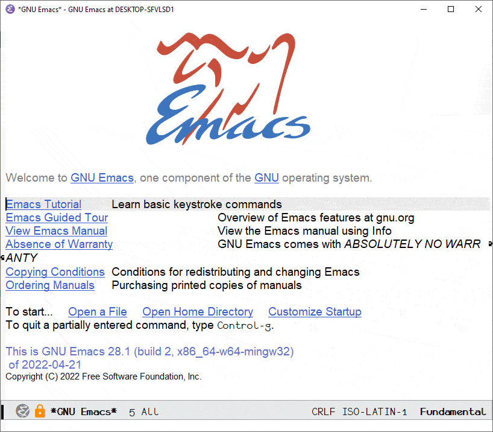

<a href="https://www.gnu.org/software/emacs/">GNU Emacs</a>

This repository contains all my GNU Emacs configuration.

---

> Theme: [espresso](https://github.com/PaperMonoid/color-theme-espresso)

> Font: [Monofur](https://www.dafont.com/monofur.font)

---

# Instructions

1. Download and install the [Monofur](https://www.dafont.com/monofur.font) font
2. Clone github repository recursively `git clone --recurse-submodules git://github.com/foo/bar.git`
3. Open Emacs and wait for installations to finish
4. Run `M-x all-the-icons-install-fonts`
5. Install the downloaded fonts
